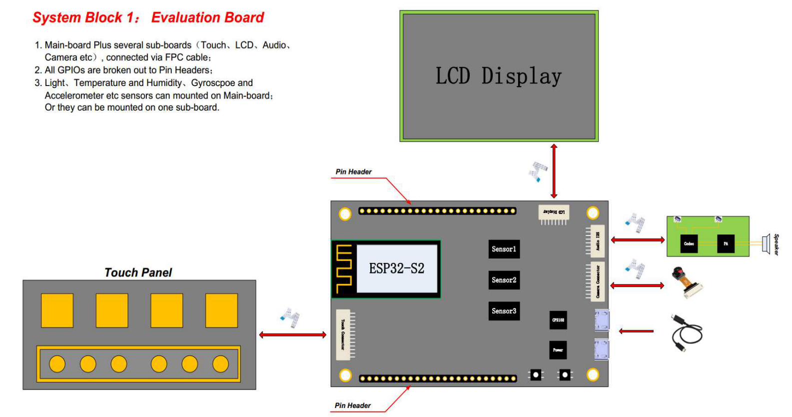

# _ESP32-S2Beta-HMI_

_HMI evaluation suite for new low power, low cost and secure Internet of Things chip ESP32-S2. ESP32-S2 chip is equipped with Xtensa 32-bit LX7 single-core processor.
Working frequency up to 240 MHz, providing a wealth of peripheral interfaces, including SPI, I2S, UART, I2C, LED PWM, PCNT, LCD interface, Camera interface, ADC, DAC,
Touch sensors, temperature sensors and up to 43 GPIOs. Supports high-resolution LCD displays and Camera Sensor, as well as a variety of extension options.
Perfectly supports open source GUI LittleVGL, providing a large number of rich and easy-to-use GUI components and design examples._


* Development board Structure

  

  * High Definition Resolution: 800x480 4.3 inch

  * Multiple interfaces: 8080, 6800, SPI

  * Easy to use and beautiful GUI: LittleVGL

  * Powerful and rich graphics components: buttons, charts, lists, sliders, images, etc.

  * A large number of sensor drivers: WS2812, MPU6050, HTS221, BH170, ES8311, OV2640 etc.

  * Multiple GUI examples: RGB LED Color picker, MPU6050 Data Curve, A simple piano, Simple Terminal, etc.

## Contents

* Directory tree

    ```
    ├── add_path.sh
    ├── docs
    ├── projects
    │   └── hmi
    ├── README.md
    └── tools
        ├── esp-idf
        └── xtensa-esp32s2-elf
    ```

    * projects

      Development examples

    * tools

      * ESP32-S2 sdk

      * ESP32-S2 toolchain

    * Data

      * Schematic diagram

      * Misc

## How to use

You can follow the steps below to set up the development environment, or directly download the release version of the full environment.

* clone

  ```bash
  git clone --recursive https://gitlab.espressif.cn:6688/yxiong/esp32-s2beta-hmi
  cd esp32-s2beta-hmi
  ```

  * note

    Don't omit `--recursive`, because we use submodule.

* update

  ```bash
  git pull
  git submodule update --init --recursive
  ```

* Install toolchain

  ```bash
  ./tools/esp-idf/install.sh
  . ./tools/esp-idf/export.sh
  ```

* Add environment variables

  ```bash
  . add_path.sh
  ```
  * note

    Don't omit `"."`

## Appendix

### Schematic

* [Main Board](docs/SCH_ESP32-S2-HMI_V1_20190528A.pdf)

* [LCD Board](docs/SCH_ESP32-S2-HMI-LCD_V1_0_20190611A.pdf)

* [Audio Board](docs/audio.pdf)

* [Touch Board](docs/TOUCH.pdf)

### Datasheet

* [ESP32-S2](docs/esp32-s2_datasheet_en.pdf)

* [LCD-NT35510](docs/LCD_NT35510.pdf)

* [CAM-OV2640](docs/LCD_NT35510.pdf)

