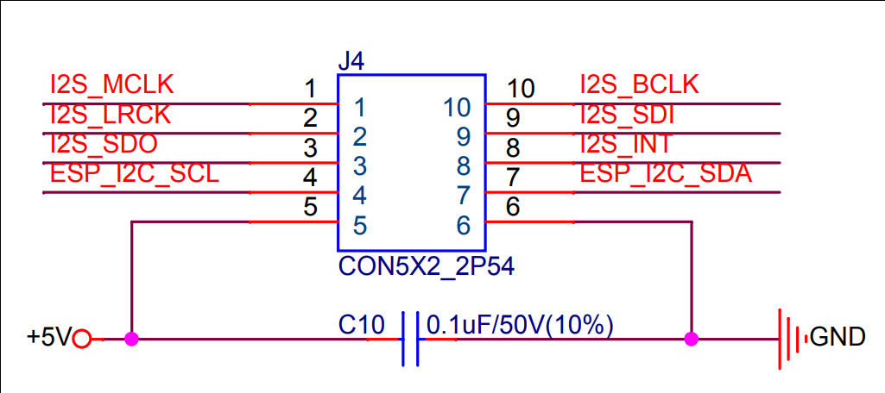

# Hello World Example

Starts a FreeRTOS task to print "Hello World"

See the README.md file in the upper level 'examples' directory for more information about examples.

## AUDIO子板

IO数量: 5 + 2(I2C)

HMI Demo使用了BCK作为主时钟提供给es8311，MCLK无需提供，I2S_INT作为PA控制脚

es8311 使用I2C接口配置寄存器，可以复用 2 IO



```
#define I2S_BCK_IO      (GPIO_NUM_15)
#define I2S_WS_IO       (GPIO_NUM_16)
#define I2S_DO_IO       (GPIO_NUM_17)
#define I2S_DI_IO       (GPIO_NUM_21)
#define GPIO_PA_EN GPIO_NUM_6

#define SDA (GPIO_NUM_3)
#define SCL (GPIO_NUM_5)
```