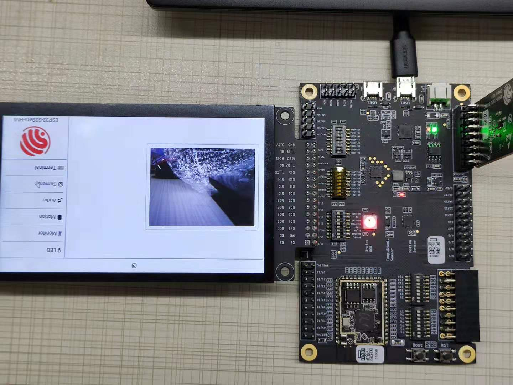
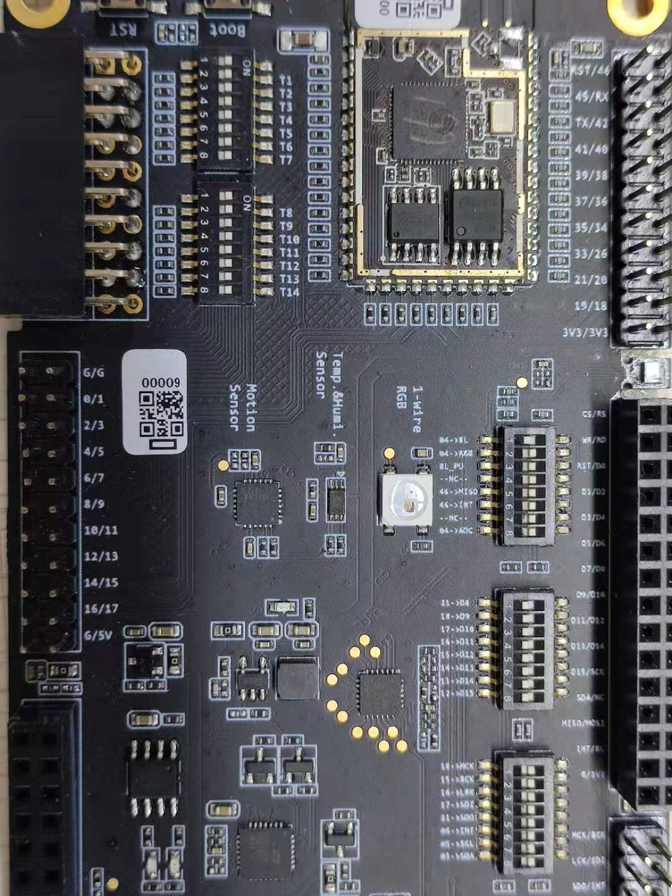
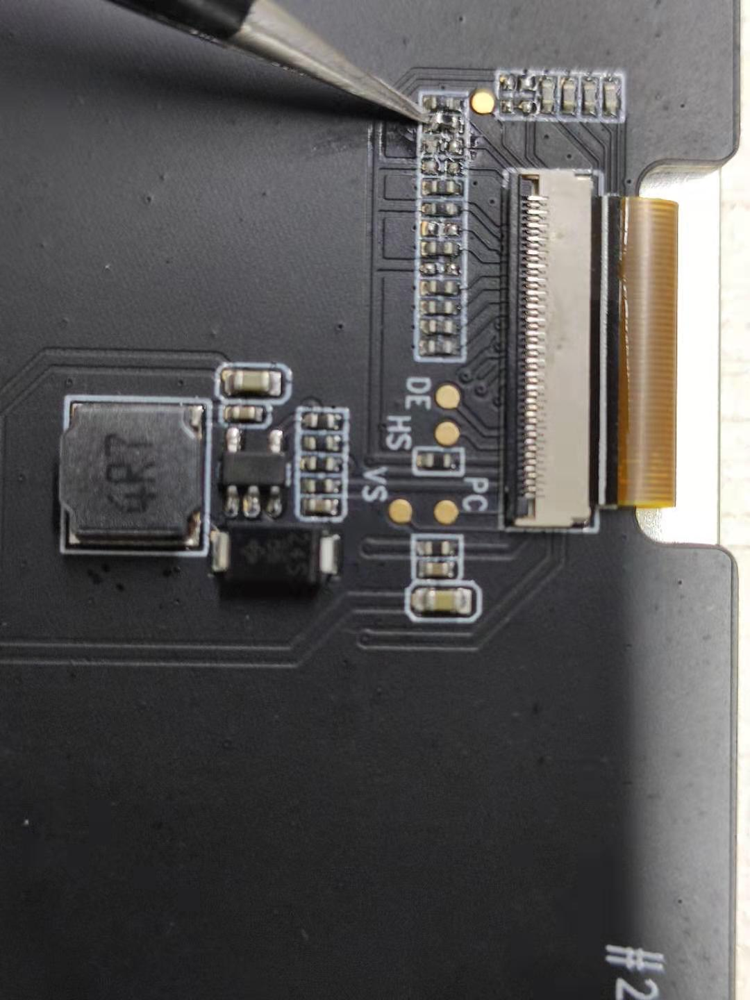
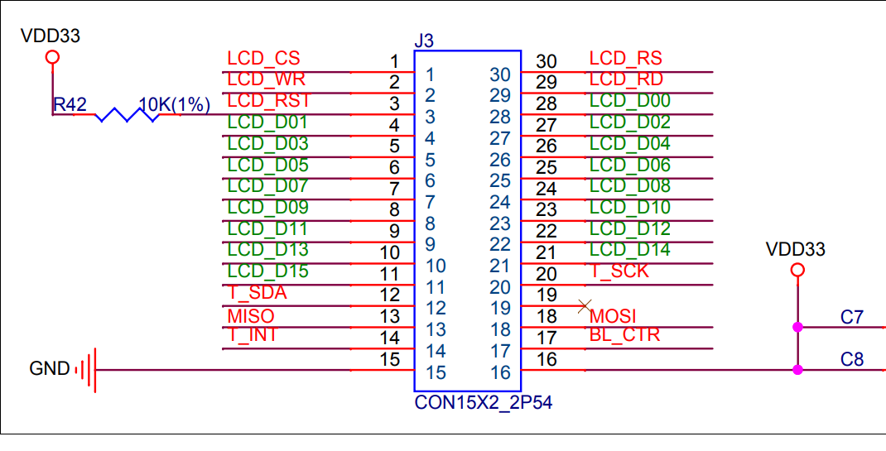
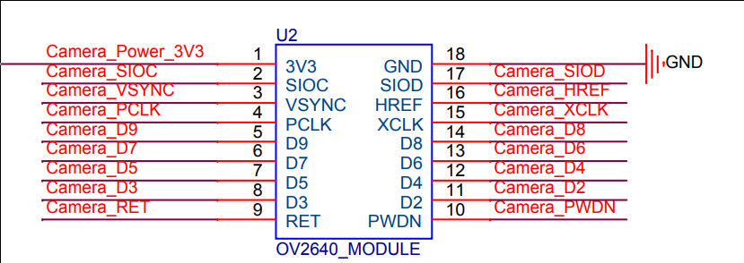

# _HMI_




## How to use

You can try the full firmware `esp32-s2beta-hmi.bin` first, address 0x0

* Compile and download

Please unplug the camera module before downloading the code!!!

```bash
idf.py set-target esp32s2beta
idf.py build flash monitor
```

When using this example, the dial switch needs to be in the following status



The LCD needs to use 8-wire mode, so the third resistor needs to be moved to the second pad



## LCD Sub-Board

IO number: 10 + 2 (I2C)

HMI demo uses 8 bit parallel mode
LCD touch uses I2C interface and can reuse 2 IO
Pay attention to keep LCD RST and BL CTR high in schematic diagram, and leave other pins blank



```
#define  WR  GPIO_NUM_34
#define  RS  GPIO_NUM_1
#define  D0  GPIO_NUM_35
#define  D1  GPIO_NUM_37
#define  D2  GPIO_NUM_36
#define  D3  GPIO_NUM_39
#define  D4  GPIO_NUM_38
#define  D5  GPIO_NUM_41
#define  D6  GPIO_NUM_40
#define  D7  GPIO_NUM_45

#define SDA (GPIO_NUM_3)
#define SCL (GPIO_NUM_5)
```

## Camera Sub-Board

IO number: 12 + 2 (I2C)

I2C used by camera should be provided independently



```
#define D0 GPIO_NUM_18
#define D2 GPIO_NUM_17
#define D4 GPIO_NUM_8
#define D6 GPIO_NUM_10

#define D1 GPIO_NUM_21
#define D3 GPIO_NUM_7
#define D5 GPIO_NUM_9
#define D7 GPIO_NUM_11

#define XCLK  GPIO_NUM_0
#define PCLK  GPIO_NUM_12
#define VSYNC GPIO_NUM_14
#define HSYNC GPIO_NUM_13

#define SIOC   GPIO_NUM_16
#define SIOD   GPIO_NUM_15
```

